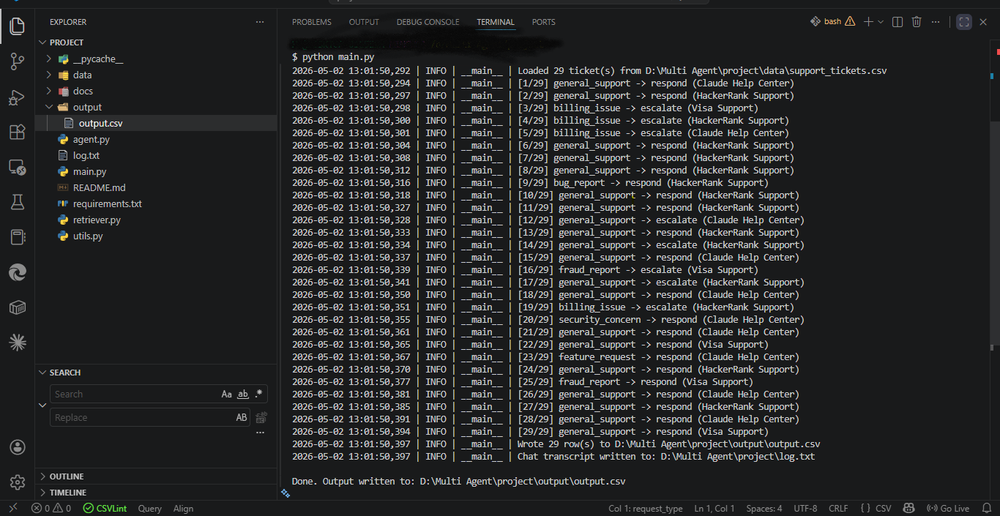

# 🤖 Multi-Domain Support Triage Agent



A terminal-based AI support triage agent built for the **HackerRank Orchestrate Hackathon**. The agent reads support tickets and intelligently decides whether to respond automatically or escalate to a human — across three different company ecosystems.


---

## 🧠 How It Works

```
Support Ticket
      ↓
Identify Request Type        → billing, fraud, bug, permissions, etc.
      ↓
Classify Product Area        → HackerRank / Claude / Visa
      ↓
TF-IDF Retriever             → finds most relevant support doc
      ↓
Safety Policy Check          → sensitive? escalate. no docs? escalate.
      ↓
Generate Grounded Response   → only from the support corpus
      ↓
Output CSV Row               → request_type, product_area, decision, justification, response
```

---

## ✅ Features

- **Multi-domain routing** — handles tickets for HackerRank, Claude (Anthropic), and Visa
- **TF-IDF retriever** with cosine similarity — no external APIs, fully local
- **Smart escalation** — fraud, billing, security, and unverifiable tickets always escalate
- **Grounded responses** — answers come only from the provided support corpus, zero hallucination
- **Structured output** — CSV with full justification per decision
- **Chat transcript logging** — full log.txt generated on every run
- **No LLM dependency** — deterministic, fast, and safe

---

## 📁 Project Structure

```
project/
├── agent.py          # Core triage logic, escalation rules, response generation
├── retriever.py      # TF-IDF retriever with cosine similarity
├── utils.py          # Logging, CSV I/O, ticket loading
├── main.py           # Entry point, argument parsing, orchestration
├── docs/
│   ├── claude_help_center.md
│   ├── hackerrank_support.md
│   └── visa_support.md
├── requirements.txt
└── README.md
```

---

## 🚀 Setup & Run

### 1. Clone the repo
```bash
git clone https://github.com/vinod-meghwar/multi-domain-support-triage-agent.git
cd multi-domain-support-triage-agent
```

### 2. Create virtual environment
```bash
python -m venv .venv

# Windows
.venv\Scripts\activate

# Mac/Linux
source .venv/bin/activate
```

### 3. Install dependencies
```bash
pip install -r requirements.txt
```

### 4. Add your support tickets
Place your CSV file at:
```
data/support_tickets.csv
```
The CSV should have an `Issue` and `Subject` column, or a `query` column.

### 5. Run the agent
```bash
python main.py
```

Optional arguments:
```bash
python main.py --input data/support_tickets.csv --output output/output.csv --log-level INFO
```

---

## 📊 Output

The agent generates two files:

**`output/output.csv`** — one row per ticket:
| Column | Description |
|---|---|
| `request_type` | billing_issue, fraud_report, bug_report, etc. |
| `product_area` | HackerRank Support / Claude Help Center / Visa Support |
| `decision` | respond or escalate |
| `justification` | why the decision was made + confidence score |
| `response` | grounded answer or escalation message |

**`log.txt`** — full run transcript with timestamps

---

## 🔐 Escalation Policy

The agent always escalates for:
- **Fraud** — unauthorized charges, stolen cards, phishing
- **Billing** — refunds, invoice disputes, charges
- **Account security** — hacked accounts, password reset, identity verification
- **Low confidence** — when no relevant doc is found (score < 0.15)

---

## 🛠️ Key Design Decisions

**Why TF-IDF over embeddings?**
No external API dependency, fully deterministic, zero hallucination risk, and fast enough for the small corpus provided.

**Why rule-based escalation?**
Safety-critical decisions (fraud, billing) should never depend on retrieval confidence alone. Hard rules ensure correctness.

**How over-escalation was prevented?**
Initially broad single-word triggers like `"access"` and `"security"` caused almost every ticket to escalate. Fixed by replacing with specific multi-word phrases like `"admin access"`, `"security breach"`, `"locked out"`.

---

## 🧰 Tech Stack

- **Python 3.10+**
- **pandas** — CSV I/O
- **TF-IDF + Cosine Similarity** — custom implementation, no sklearn needed
- **Standard library only** — `logging`, `csv`, `re`, `math`, `pathlib`

---

## 📝 Notes

- Built with the help of AI tools — focused on architecture decisions, debugging, and escalation logic design
- The support corpus (`docs/`) is intentionally minimal for the hackathon scope
- For production use, replace TF-IDF with sentence-transformers for better semantic retrieval

---

## 📄 License

MIT License — feel free to use and extend.
